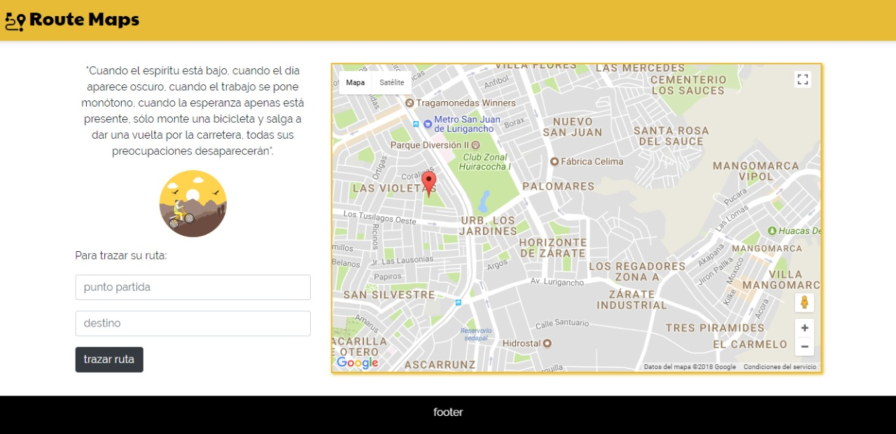

# Easy-Vreco(Route maps)

* **Track:** _Common Core_
* **Curso:** _Connstruye una single page (SPA) multi-uusuario consumiendo data remota_
* **Unidad:** _Ejercicio con Easy-Vreco_

*** 
[PRUEBA EASY VRECO](https://github.com/MelynaPernia/easy-vreco).

***
## OBJETIVO

* Mediante la geolocalización y la api de **google maps**  elaboramos una aplicación que encuentre tu posición actual y traze un ruta con la posicion final que indicaras en el input de destino.

## PROCESO

* Ubicar un mapa de Google Maps indicando nuestra ubicación actual.

* Atravez de los inputs **punto de partida** y **destino**  poder trazar una ruta en el mapa que indique ese recorrido.

* Puntos Adicionales: Cambiar el marcador que tiene por defecto  google  en el mapa por una imagen de bicicleta y diseño personalizado.

## Ejemplos

## Recursos

- Html,css,javascript.
- Jquery.
- Framework, Bootstrap.
- API Geolocation.
- API Google Maps

## Integrantes(GitHub)

* [LAURA JIMENEZ](https://github.com/LauraJH16)
* [MARINA RODRIGUEZ](https://github.com/MarinaRH)
* [MELINA PERNIA ](https://github.com/MelinaPernia)